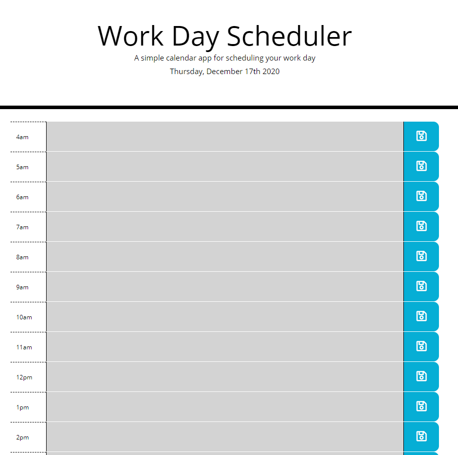

# calendar-app
## Completed by: 
### Daniel S

 

- - - - 

## Goals: 
### Utilize jQuery and moment.js to utilize APIs and to dynamically update a day planner. Also utilize local storage to track the users schedule for the day and save it for when they return.

 

## Key Functionality:
* Current day is displayed at the top of the cal
* Time blocks for standard business hours plus extra
* Each block is color coded for past (grey), present (red), future (green)
* When a block is clicked, an event can be entered
* The save icon on the right saves the data into local storage
* When refreshed, the saved events persist

 

## Skills practiced: Jquery, Local Storage, Moment.js/APIs

 

## Instructions:
* Load the page
* Any previously saved entries into the schedule will populate the text entry cells
* Add or delete any text needed for scheduling
* Click the save icon to the right of the input where data was entered
* Refresh the page as needed and the present hour input will highlight in red, with future inputs highlighted in green and past inputs, grey
* All entries should remain in their cells after refresh
* The current day is displayed at the top of the page

## Link: https://desasser.github.io/calendar-app/

 

## Screenshot: 
